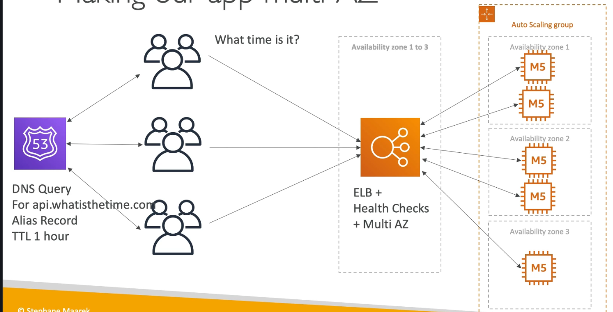

# AWS Ultimate Certified Solutions Architect Associated 2021

---

[Architecture Plans](https://aws.amazon.com/architecture)
[Architecture Solutions](https://aws.amazon.com/solutions)

## ALL Services

## AWS Regions

- AWS Global cloud provider with many data centers around the world, e.g us-east-1, eu-west-3, (usually 3, min 2 max 6) / ap-southeast-2a/2b/2c

- **_AZs_** represents data centers with redundant power networking and connectivity - [Full AWS Regions](https://aws.amazon.com/about-aws/global-infrastructure)

  

## IAM Introduction

- Acronym for Identity and Access Management
- All related security services are here:
  > Users
  > Groups contains Users
  > Roles used with resources
- IAM Federation
  > Big Enterprises can login in AWS using their company credentials using identity federation with SAML standard (Active Directory)
- One IAM User per PHYSICAL PERSON, never share credentials info aws passwords etc
- One IAM Role per Application
- **_Never_** keep IAM credentials hard-coded
- ROOT Account must be used just for initial Setup
- Initial User with **_Attached existing Policies directly_** and Admin permissions, after create a Group (admin) with recent user created and **_AdministratorAccess Policy_**

## EC2

- Most popular service offered by AWS
- Consist in the capability of
  > Virtual Machines (EC2)
  > Store data on virtual drives (EBS)
  > Spread load across machines (ELB)
  > Scaling the services using an auto-scaling group (ASG)
- AMIS stands AWS Machine Image, basic represents OS and Software over the machine **_whoami_**

## Security Groups

- Are the fundamental of network security in AWS
- They Control how traffic is allowed into or out of our EC2 Machine, basic control inbound/outbound traffic
- Outbound all traffic is allowed
- To use SSH must be enale 22 port on Inbound Rules over _0.0.0.0/0,::0_
- Security Groups are acting as a "firewall" over EC2 instances
- Can be attached to multiples instances
- Locked down to a region
- It's good to mantain one separate sg fo SSH access
- Private/Public IPs (IPv4) is the most common in AWS, when a company have a private network it can talk to AWS using Internet Gateway 
- Public IP the machine can be identified on the internet (WWW)
- Private IP means the machine can only be indentified on a private network only, two diferent private networks (two different companies) can have the same IPs
- Is a fixed public IP for your instance, you can attach it to one instance at a time, try avoid using EIP, or use Load Balancer
- By default EC2 comes with
  - A private IP for internal AWS Network
  - A public IP, for the WWW
- SSH don't use private IP, can be only public IP
- With EIP even after stop EC2 instance they keep attached on it

---

## EC2 Instances Type

- On demand instances - short, predictable pricing
  - Reserved
  - Spot Instances
  - Dedicated Instances
  - Dedicated Hosts
- On Demand has the highest cost but no upfront payment, prefered for elastic workloads
- Reserved Instances up to 75% over on-demand
  - Scheduled Reserved Instances - launch within time window
  - Spot instances up to 90% over on-demand - not great for critial jobs or databases
- Combo - Reserved Instances for Web App + On Demand to Back End App Workloads
- EC2 Classification
  - R application that needs a lot of RAM - in-memory caches
  - C application that needs good CPU - compute / databases
  - M application that are balanced - general / web app
  - I application that need good I/O - databases
  - G application that need GPU - machine learning
  - T2/T3 burstable instances
  - Real world tips [EC2 Types](https://www.ec2instances.info)
- EC2 AMIs the images bellow can be customised at runtime using EC2 User Data
  - Ubuntu
  - Fedora
  - RedHat
  - Windows
  - Custom AMIs 
  - Public AMIs, dont recommended
- Placement Groups
- Elastic Network Interfaces (ENI) represents virtual card net to gives EC2 instances access to network each have the attrs:
  - Primary private IPv4 one or more secondary IPv4
  - One Elastic IP (IPv4) per private IPv4
  - One Public IPv4
  - A Mac Address
  - Can be attached in EC2 instance
- EC2 Hibernate
  - The in-memory (RAM) state is preserved
  - The instance boot is much faster
  - Supported by C, M and R AMI's family

## Scalability & High Availability

- Vertical and Horizontal (elasticity) Scalabities
- Vertical scalability means increasing the size of the specific instance
- Horizontal scalabitity means increasing the number of instances
- High availability means run app at the least 2 data center (Availability Zones)

## Load Balancing

- Servers that forward internet traffic to multiple servers (EC2 Instances)
- Exposes a single point of acess (DNS) to your app
- Health checks are crucial for LBrs
- LBrs are classified as Classic LB (old generation), Application LB (v2 new generation), Network LB (v2 new generation)
- Over LBs we must allows that the EC2s Security Groups allows traffic only coming of LBs
- Application load balancers is Layer 7 (HTTP), can be used with multiple http applications across the machines, can be used with multiple apps on the same machine ex - containers offers support to HTTP/2 and WebSocket
- ALB allows routing by Url (doman.com/foo), routing by hostname by query srting is great for microservices and containers apps
- Same ALB allowing multiple route traffic  in different apps using target groups
- Network LB uses Layer 4 to allows traffic over TCP & UDP to instances, have a high performance, latency is 100ms vs 400ms ALB, have one static IP per AZ and supports Elastic IPs 
- ALB using Stickiness 
- SSL Rules for LBs 

## Auto Scaling Group (ASG)

- Scale out (add EC2 instances) to match an increased load
- Scale in (remove EC2 instance) to match a decreased load
- Ensure we have a minimum and maximum number of machines running
- Automatic registers news instances when load goes up
- ALB and ASG works hand in hand 
- Scaling Policies

  1. Target Tracking Scaling, average ASG CPU to stay at around 40%

  2. Simple / Step Scaling, CloudWatch alarm is triggered (CPU>70%), then add 2 units

  3. Scheduled Actions, Antecipate a scaling based on known usage patterns, eg. increase the min capacity to 10 at 5 pm on Friday

  4. ASG Cooldown Rules 

## RDS Aurora and ElastiCache

- Relation Data base Services using SQL composed by _Postgres, MySQL, MariaDB, Oracle, SQL Server Aurora AWS_
- RDS is a managed service
- Can't access by SSH int your instances
- Avoid scaling your database storage
- Can create up to 5 Read Replicas, replication is async so reads can eventually fail over consistency when look to updated data
- There's a network cost when data goes from one AZ (east-weast) to another
- RDS Encryption works with Rest and AWS KMS - AES-256 encryption
- RDS are usually deployed within a private subnet, not a public one
- MySQL and Postgresql needs a token (exp. 15min) to connect in db
- Amazon Aurora not open sourced, both MySQL and Postgres are supported as Aurora DB (that means your drivers will work as Aurora)
- Elastic Cache is same way of RDS and is manged by Redis or Memcache
- Caches are in-memory databases with really high performance and low latency
- To Complex structures or backup options Redis is a best option

- FTP: 21
- SSH: 22
- SFTP: 22 (same as SSH)
- HTTP: 80
- HTTPS: 443
- PostgreSQL: 5432
- MySQL: 3306
- Oracle RDS: 1521
- MSSQL Server: 1433
- MariaDB: 3306 (same as MySQL)
- Aurora: 5432 (if PostgreSQL compatible) or 3306 (if MySQL compatible)

## Route 53

- Is a managed DNS
- DNS is a collection of rules and records which helps clients understand how to reach a server through its domain name

- Most common in AWS are _A: hostname to IPv4_ - _AAAA: hostname to IPv6_ - _CNAME: hostname to hostname_ and _Alias: hostname to AWS resources_
- A preview 
- Advanced features are Load Balancing (throuhg DNS - also called client load balancing), Health checks (although limited) and Routing policy as simple, failover, geo-location, latency, weighted and multi value
- CNAME points a hostname to any other hostname, **only not for root domain**, this resource can be a Load Balancer
- ALIAS points a hostname to an AWS Resource, works for root and non root domain

## Classic Solutions Architecture Discussions

- Stateless WebApp - Foo WebApp (No database) 
- Stateful WebApp - Bar WebApp (Session Stickiness and Session Affinity)  can use session cookis also (never do this)
- Stateful WebApp - Bar WebApp (Using Elastic Cache if history of sales is not necessary) 
- Stateful WebApp - Bar WebApp (Using Elastic Cache and AWS RDS - Correct Solution) 
- Scaling fast Pattern 

## AWS S3

- Allows store objects (files) in buckets
- The key is the fully path i.e s3://my-bucket/my_folder1/my_file.txt
- Have MFA Store
- Access Logs
- S3 Cross/Same Region Replication Async

## AWS CloudFront

- Content Delivery Network
- Improves read performance, content is cached at the edge

## SQS, SNS and Kinesis

### SQS

- SQS, simple queue message supports multiple producers messages, poll messages by multiple consumers
- Produce to SQS using AWS SDK (SendMessage API), message up to 256kb
- Consumers receive and process messages in parallel
- Consumers delete messages after processing them
- Message visibility timeout 
- DLQ are supported in SQS, must configure a threshold of how many times a message can go back to the queue and after the **MaximumReceives** property is exceed the message goes into a dead letter
- Supports FIFO pattern (ordering message), but have throughput limited in 300 msg/s without batching

### SNS

- Send one Message to many Subscriber

### Kinesis

- Makes it easy to collect, process and analyze streaming data in real-time
- Ingestion real-time data as application logs, metrics, website clickstreams etc

### AWS MQ

- Open Source and integrated with on-premise apps with supported protocols MQTT, AMQP, STOMP
- AWS MQ is managed Apache MQ
- Don't scale as SQS, it runs on dedicated machine and can run in HA with failover

## ECS, Fargate ECR and EKS

- ECS Elastic Container Service, needs a provision & maintain infrastructure over ec2 instances

## CloudWatch Metrics

- CloudWatch provides metrics for every services in AWS
- Can use detailed monitoring if you want to more prompt scale your ASG
- Can setup quick dashboards to look key metrics
- Applications can send logs to CloudWatch using that SDK
- CloudWatch can collect logs from
  1. Elastic BeansTalk: collection of logs from application
  2. ECS: collection from containers
  3. AWS Lambda: collection from function logs
  4. VPC Flow
  5. API Gateway
  6. CloudTrail
  7. Route53 in DNS Queries
- CloudWatch logs can use filter expressions, i.e find a specific IP inside log, must have IAM Policy like CloudWatchLogFullAccess 
- CloudTrail provides governance, compliance and audit from your AWS account, **is enabled by default**, you can get history of events from api call made in aws account to
  1. Console
  2. SDK
  3. CLI
  4. AWS Services
  5. Can put logs from CloudTrail into CloudWatch Logs or S3
  6. Examples of use "If a resource was deleted in AWS, use CloudTrail first!"

## AWS STS (Security Token Service)

- Allows to grant limited and temp access to an AWS resource

## AWS Organizations

- Allows to manage multiple AWS accounts  - 

## AWS Security & Encryption

- Encryption in flight (SSL) data protected online, data encrypted before sending and decrypted after receiving, traditional SSL (HTTPS) to protect from MITM
- Data Keep encrypted after being received by the server

### AWS KMS

- Easy way to control access to your data, most of time related to KMS
- Use KMS to database passwords, credentials to external services private key ssl

## WAF

- To protect web app in layer exposed

## Networking VPC

- Virtual Private Cloud
- We can have multiple VPCs in a region (max 5 per region)

### CIDR - IPV4 to Public and Private IPs

- CIDR are used for Security Groups rules, or AWS networking in general
- The helps to define IP address range
- Have two components as base IP and Subnet Mask
- [IP Address Guide](https://www.ipaddressguide.com/cidr)

### VPC Walkthrough

- All new account have a default VPC
- News instances are launched into VPC if no subnet is specified
- Default VPC **have internet connectivity and all instances have a public IP**
- Public and a private DNS name

### Subnets

- Available in multiple Zones as Private and Public

### Internet Gateway

- Internet Gateway helps our VPCs instance connect to the Internet
- It scales horizontally and is HA and redundant
- Must be created separately from VPC
- One VPC can **only** be attached to one IGW and vice versa
- Internet Gateway is also a NAT for the instances that have a public IPV4
- IGW on their own dot not allow internet access, route table must be edited 

### Nat Instances (Outdated)

- Allows instances in the private subnets to connect to the internet
- Must be launched in a public subnet
- Must have a Elastic UP attached to it

### White papers and Architectures

- Stop guest about your capacity
- Test system at production scale
- Automate to make your architecture easy
- Use Well Architected practices
- Operation Excellence
  1. Run and monitor systems
  2. Perform infra as a code
- Security
  1. Ability to protect your information, systems, and assets
  2. Enable traceability
  3. Strong identity foundation
  4. Apply security in all layers
  5. Protected data in transit and at rest with Encryption token and access control
  6. Keep people away from data
- Performance Efficiency
  1. Use computing with resources efficiently
  2. Use serverless architectures

### Nat Gateways

- AWS managed Gateway, higher bandwidth, better availability no admin
- Pay by the hour for usage and bandwidth
- NATg is create in a specific AZ and uses EIP (Elastic IP)
- Cannot used by a instance and require a IGW (Private Subnet -> NAT -> IGW)
- No security group is require to manage it
- For high availability you need create multiple AZs Gateway for fault-tolerance, 

### DNS Resolution in VPC

- enabledDnsSupport/enableDsnHostName must be enabled to create hostname in Route53

### Network NACLs and Security Groups

- NACL Rules -> SG Inbound Rules from external access
- NACL are like firewall which control the traffic from and to subnet
- Default allows everything outbound and everything inbound
- One NACL per subnet, new subnets are assigned the Default NACL

### VPC Peering

- Connect two VPC, privately using AWS network without overlapping CIDR

### VPC Endpoints

- Avoid all traffic from NATg from private network to connect in AWS Services, it allow connect to AWS Services using private network instead of public www network
- They scale horizontally and are redundant and remove the need of IGW, NAT etc
- It is a Interface ENI (private IP address) or Gateway to provision a target and must be used in a route table
